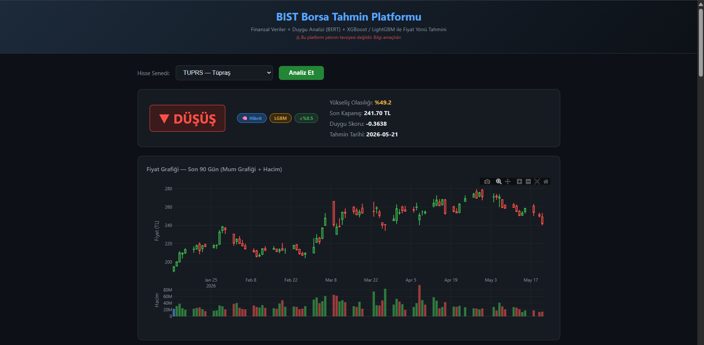
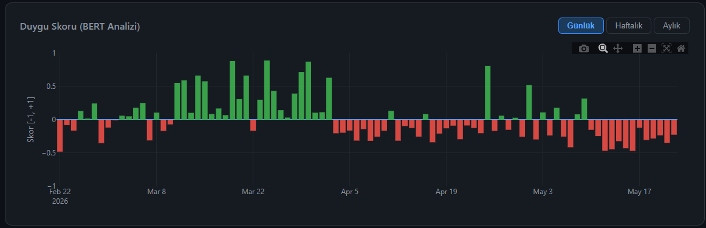
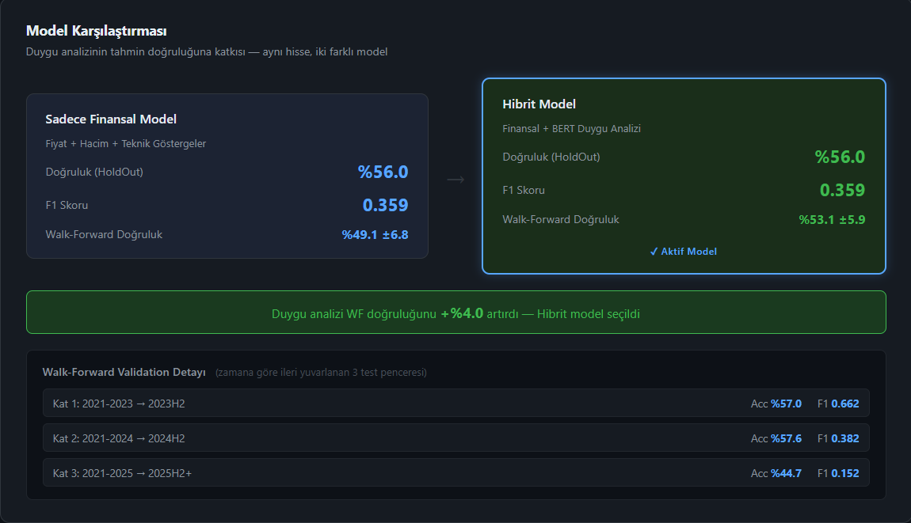
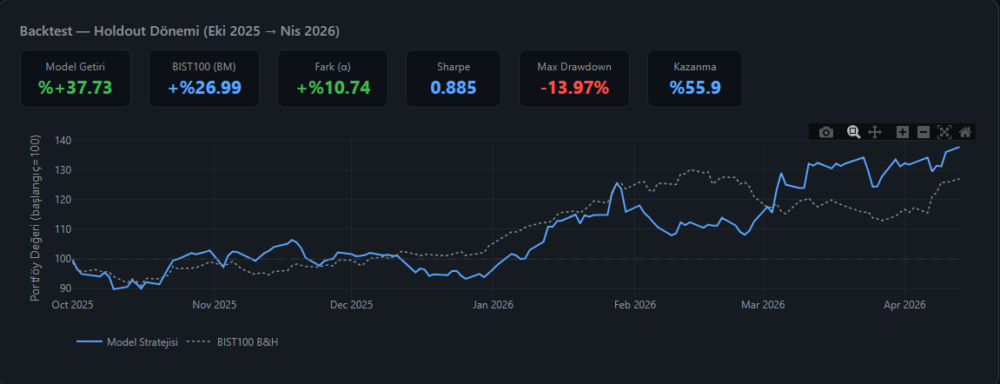
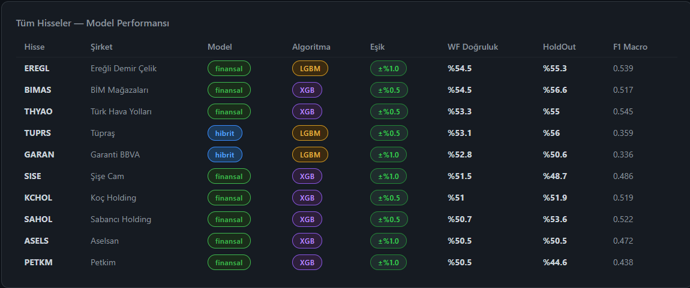

# BIST Tahmin Platformu

**Türk borsası (BIST) hisse senetleri için makine öğrenmesi tabanlı fiyat yönü tahmin platformu.**

Finansal göstergeler ile Türkçe haber ve sosyal medya verilerinden üretilen BERT duygu skorlarını birleştirerek XGBoost/LightGBM modelleriyle bir sonraki günün yönünü (YÜKSELİŞ / DÜŞÜŞ) tahmin eder.

---

## Ekran Görüntüleri

### Tahmin & Fiyat Grafiği


### BERT Duygu Skoru Analizi


### Model Karşılaştırması (Finansal vs Hibrit)


### Backtest — Holdout Dönemi (Eki 2025 → Nis 2026)


### Tüm Hisseler Model Performansı


---

## Özellikler

- **İki model karşılaştırması:** Sadece finansal veri kullanan model ile BERT duygu analizini de içeren hibrit modelin doğruluk ve F1 skorları yan yana
- **Walk-forward validasyon:** Zamana göre 3 pencereli ileri yuvarlanan validasyon — veri sızıntısı yok
- **Holdout backtest:** Ekim 2025 → Nisan 2026 dönemi long-only strateji vs. BIST100 buy&hold benchmark
- **Duygu analizi:** Ekşi Sözlük, haber siteleri, Telegram ve KAP duyurularından BERT tabanlı Türkçe duygu skoru
- **Otomatik pipeline:** APScheduler ile günlük veri çekme ve model güncelleme
- **Flask web arayüzü:** Mum grafiği, duygu skoru grafiği, sinyal geçmişi, özellik önemi

## Desteklenen Hisseler

GARAN · THYAO · KCHOL · EREGL · TUPRS · BIMAS · ASELS · SAHOL · SISE · PETKM

---

## Teknoloji Yığını

| Katman | Teknolojiler |
|--------|-------------|
| **ML / Modeller** | XGBoost, LightGBM, scikit-learn |
| **Duygu Analizi** | Transformers (BERT — `savasy/bert-base-turkish-sentiment-cased`) |
| **Veri Toplama** | yfinance, BeautifulSoup, Telethon |
| **Backend** | Flask, APScheduler, SQLite |
| **Frontend** | Vanilla JS, Plotly.js |

---

## Kurulum

### Gereksinimler

- Python 3.10+
- ~4 GB RAM (BERT modeli için)

### Adımlar

```bash
# 1. Repoyu klonla
git clone https://github.com/MuhammettSanli/bist-tahmin-platformu.git
cd bist-tahmin-platformu

# 2. Sanal ortam oluştur
python -m venv venv
venv\Scripts\activate      # Windows
# source venv/bin/activate  # Linux/macOS

# 3. Bağımlılıkları yükle
pip install -r requirements.txt

# 4. Veritabanını oluştur
python database.py

# 5. Geçmiş fiyat verilerini çek
python pipeline.py

# 6. Modelleri eğit (ilk eğitim ~10-20 dakika)
python ml/model_egitimi.py

# 7. Uygulamayı başlat
python app.py
```

Tarayıcıda `http://localhost:5000` adresini aç.

### Ortam Değişkenleri

`.env.example` dosyasını kopyalayarak `.env` oluştur:

```bash
cp .env.example .env
```

```env
FLASK_SECRET_KEY=guclu-rastgele-bir-anahtar
ADMIN_SIFRE_HASH=sifrenizin-sha256-hashi
```

SHA256 hash üretmek için:
```python
import hashlib; print(hashlib.sha256("sifreniz".encode()).hexdigest())
```

---

## Proje Yapısı

```
├── app.py                  # Flask API (tahmin, backtest, karşılaştırma endpoint'leri)
├── database.py             # SQLite şeması ve başlangıç verisi
├── features.py             # Ortak özellik mühendisliği (RSI, MACD, Bollinger vb.)
├── pipeline.py             # Günlük veri toplama ve güncelleme pipeline'ı
├── model_utils.py          # Kalibreli model wrapper
├── ml/
│   ├── model_egitimi.py    # XGBoost/LightGBM eğitim, walk-forward, backtest
│   ├── duygu_analizi.py    # BERT duygu skoru hesaplama
│   └── backtest.py         # Strateji backtest motoru
├── collectors/             # Veri toplayıcılar (haber, Ekşi, KAP, Telegram...)
├── models/                 # Eğitilmiş modeller — .gitignore'da (yeniden üretilir)
├── data/                   # SQLite veritabanı — .gitignore'da
├── static/                 # CSS + JS
├── templates/              # HTML şablonları
└── tests/                  # Birim testleri
```

---

## Model Mimarisi

```
Finansal Özellikler          BERT Duygu Özellikleri
(RSI, MACD, Bollinger,   +   (duygu_skoru, haber_sayisi,
 momentum, hacim, lag'lar)    kaynak_konsensus, std...)
          │                              │
          └──────────┬───────────────────┘
                     ▼
           XGBoost / LightGBM
           (scale_pos_weight ile
            dengesiz sınıf düzeltmesi)
                     │
              ┌──────┴──────┐
           Eşik %55      Güven Skoru
              │
    YÜKSELİŞ / DÜŞÜŞ / BELİRSİZ
```

---

## Önemli Notlar

- **Yatırım tavsiyesi değildir.** Bu platform araştırma ve eğitim amaçlıdır.
- Modeller geçmiş veriye dayanır; gelecekteki performansı garanti etmez.
- Holdout dönemi Ekim 2025 sonrasına ayarlanmıştır; eğitim setini kirletmez.
